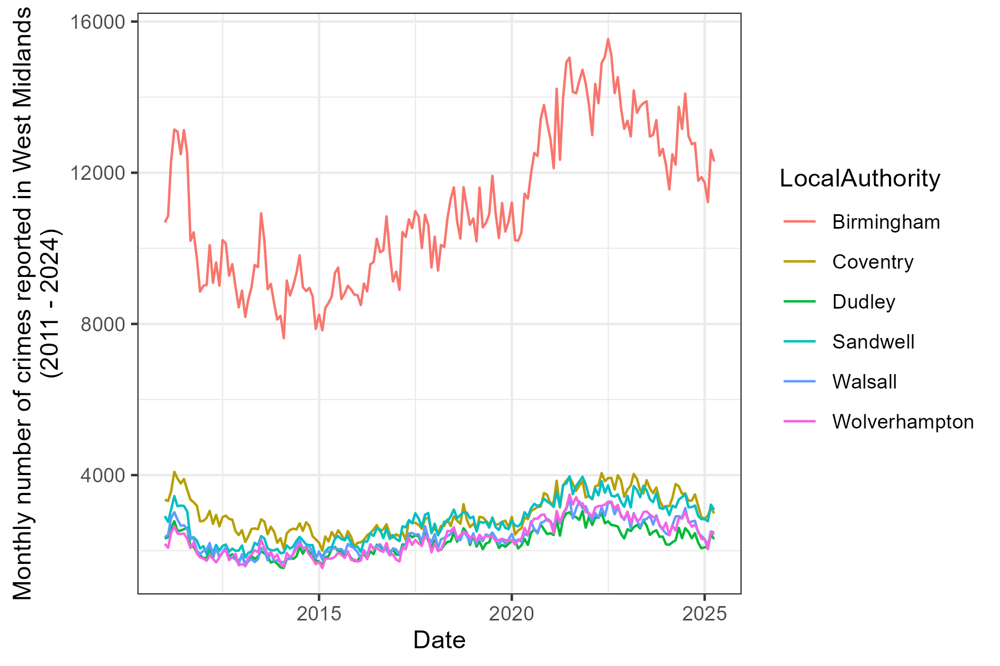

# West Mids Crime Reporting

Code to collate archived police crime reporting data from: https://data.police.uk/data/archive/

### License

This repository is dual licensed under the [Open Government v3]([https://www.nationalarchives.gov.uk/doc/open-government-licence/version/3/) & MIT. All code can outputs are subject to Crown Copyright.
